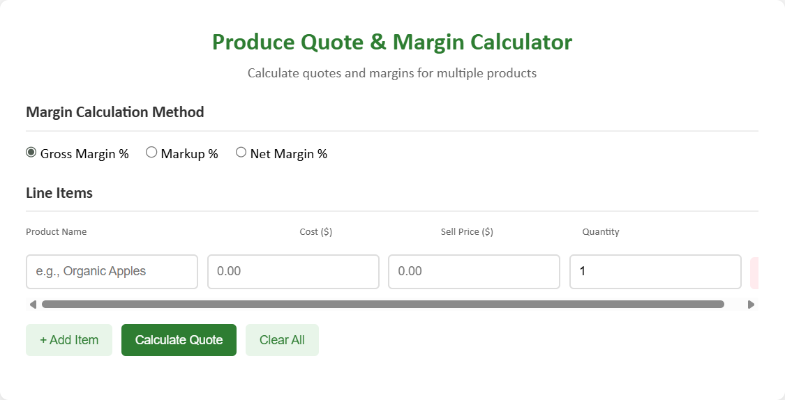

# Produce Quote & Margin Calculator

A web-based tool for produce wholesalers and retailers to quickly calculate quotes with multiple margin calculation methods, designed for efficient pricing and profitability analysis.

🔗 **[Live Demo](#)** _(Add your GitHub Pages link here once deployed)_



## Features

### Core Functionality
- **Multi-Item Quotes** - Add unlimited line items with product name, cost, sell price, and quantity
- **Dynamic Calculations** - Real-time profit and margin calculations per item and overall
- **Three Margin Methods**:
  - **Gross Margin %** - `(Sell - Cost) / Sell × 100`
  - **Markup %** - `(Sell - Cost) / Cost × 100`
  - **Net Margin %** - `Profit / Revenue × 100`

### Professional Tools
- **Print-Optimized Quotes** - Clean, professional printable format with automatic date stamping
- **CSV Export** - Export quote data for spreadsheet analysis
- **Copy to Clipboard** - Formatted text output for emails and messages
- **Color-Coded Results** - Visual indicators for profitable (green) vs. unprofitable (red) items

### User Experience
- **Keyboard Shortcuts** - Press Enter in the last row to quickly add new items
- **Smart Form Controls** - Auto-focus on product name when adding new rows
- **Empty State Handling** - Requires at least one line item, prevents accidental deletions
- **Responsive Design** - Adapts to mobile, tablet, and desktop screens
- **Hover Tooltips** - Formula explanations on margin calculation methods

## Tech Stack

- **HTML5** - Semantic markup for accessibility
- **CSS3** - Modern styling with CSS Grid, Flexbox, and print media queries
- **Vanilla JavaScript** - No frameworks, pure DOM manipulation
- **Local Storage** - _(Future enhancement opportunity)_

## How to Use

1. **Select Margin Method** - Choose how you want margins calculated (Gross/Markup/Net)
2. **Add Products** - Enter product name, unit cost, sell price, and quantity
3. **Calculate Quote** - Click "Calculate Quote" to see detailed results
4. **Export or Print** - Use export options to save or share your quote

## Code Highlights

### Dynamic Row Management
```javascript
// Unique ID system ensures proper row tracking and deletion
let itemCounter = 0;
function addLineItem() {
  itemCounter++;
  const id = itemCounter;
  lineItems.push(id);
  // Creates dynamic input rows with unique identifiers
}
```

### Flexible Margin Calculations
```javascript
function calculateMargin(cost, revenue, profit, type) {
  if (type === 'markup') {
    return cost > 0 ? (profit / cost) * 100 : 0;
  } else if (type === 'net') {
    return revenue > 0 ? (profit / revenue) * 100 : 0;
  } else {
    return revenue > 0 ? (profit / revenue) * 100 : 0;
  }
}
```

### Security Best Practices
```javascript
// XSS prevention when displaying user input
function escapeHtml(text) {
  const div = document.createElement('div');
  div.textContent = text;
  return div.innerHTML;
}
```

## Project Structure

```
produce-margin-calculator/
├── produce_calc.html   # Main HTML structure
├── calc.css            # Styling and responsive design
├── calc.js             # Calculator logic and interactions
├── screenshot.png      # Calculator in action   
└── README.md           # Project documentation
```

## Installation

1. Clone the repository:
```bash
git clone https://github.com/mjbusch2121/produce-margin-calculator.git
```

2. Open `produce_calc.html` in your browser - no server required!

## Future Enhancements

- [ ] Save quotes to localStorage for session persistence
- [ ] Customer information fields for formal quotes
- [ ] Tax calculation options
- [ ] Multi-currency support
- [ ] Quote templates for common product bundles
- [ ] Email integration for sending quotes directly

## Learning Outcomes

This project demonstrates proficiency in:
- **DOM Manipulation** - Dynamic element creation and removal
- **Event Handling** - Click events, keyboard shortcuts, form interactions
- **Data Management** - State tracking with arrays and unique identifiers
- **Responsive Design** - Mobile-first approach with CSS Grid and Flexbox
- **Print Styling** - Professional document generation with CSS media queries
- **User Experience** - Thoughtful UX patterns like auto-focus and confirmation dialogs
- **Code Organization** - Clean, commented, maintainable JavaScript

## Browser Compatibility

- ✅ Chrome/Edge (latest)
- ✅ Firefox (latest)
- ✅ Safari (latest)
- ✅ Mobile browsers (iOS Safari, Chrome Mobile)

## License

MIT License - Feel free to use this project for personal or commercial purposes.

## Author

**Mike** - Produce enthusiast and web developer  
[GitHub] https://github.com/mjbusch2121 | [Portfolio] michaelbuschportfolio.com | [LinkedIn] https://www.linkedin.com/in/mike-busch-0b343a34b/

---

*Built as a portfolio project to demonstrate HTML, CSS, and JavaScript fundamentals while solving a real-world business need.*
